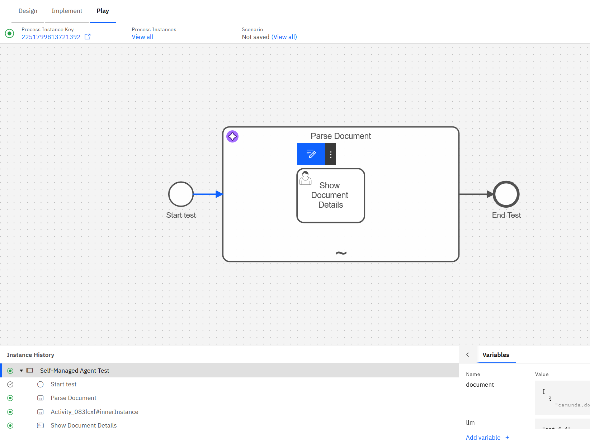
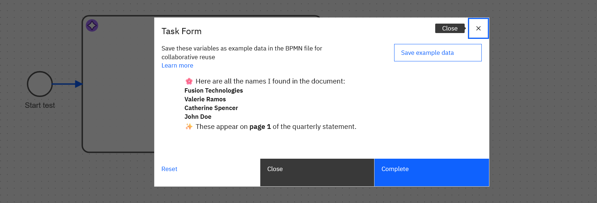

# Camunda 8 Self-Managed Agent Test

A test project to verify your Camunda 8 self-managed environment is properly configured to run agentic AI processes using the AI Agent Connector.

 

## Overview

This project provides a simple agentic process that demonstrates document parsing capabilities using AI. It's designed to help you verify that you have all the necessary components, connectors, and configurations in place to run AI-powered workflows in your Camunda 8 self-managed environment.

## What This Process Does

The **Self-Managed Agent Test** process:

1. **Starts with a user form** where you can:
   - Enter custom instructions for the AI agent (e.g., "Find all the names in the document")
   - Upload a document (PDF, text, or other supported formats)
   - Select which LLM model to use (gpt-4o or gpt-5.4)

2. **Processes the document** using an AI agent that:
   - Parses the uploaded document
   - Follows your specific instructions
   - Uses OpenAI's language models to analyze and extract information
   - Can call tools as needed to fulfill your request
   - Maintains conversation context with in-process memory

3. **Displays the results** in a user-friendly format with markdown formatting and enhanced presentation

## Features

- **Agentic AI Processing**: Uses the Camunda AI Agent Connector to create an autonomous agent that can reason about tasks and use tools
- **Document Analysis**: Upload and analyze various document types
- **Flexible Instructions**: Custom prompts allow you to ask the agent to perform different tasks on your documents
- **LLM Selection**: Choose between different OpenAI models based on your needs
- **Visual Feedback**: Results are displayed in a formatted user task
- **Memory Management**: Agent maintains context across tool calls with configurable context window
- **Tool Extensibility**: Built on an ad-hoc subprocess pattern that can easily be extended with additional tools

## Prerequisites

Before running this process, ensure you have:

1. **Camunda 8 Self-Managed** installed and running (version 8.8.0 or higher)
2. **OpenAI API Key** - You'll need an active OpenAI account with API access
3. **AI Agent Connector** installed in your environment
4. **Connector Runtime** configured and running

## Setup Instructions

### 1. Install the AI Agent Connector Template

The AI Agent Connector template must be installed in your Camunda environment:

1. Visit the [Camunda Marketplace - AI Agent Connector](https://marketplace.camunda.com/en-US/apps/522488/ai-agent-connector)
2. Download the connector template JSON file
3. Install it in your Camunda Modeler or Web Modeler:
   - **Desktop Modeler**: Place the connector template in your `.camunda/element-templates` directory
   - **Web Modeler**: Upload via the Connector Template management interface in your organization settings

### 2. Configure OpenAI API Secret

You need to configure your OpenAI API key as a secret in Camunda:

#### Using Camunda Console (Recommended)

1. Navigate to your Camunda Console
2. Go to **Organization Settings** → **Secrets**
3. Create a new secret:
   - **Name**: `OpenAI`
   - **Value**: Your OpenAI API key (starts with `sk-...`)
   - **Type**: API Key
4. Save the secret

#### Using Environment Variables

Alternatively, configure the secret using environment variables in your connector runtime:

```bash
CAMUNDA_CONNECTOR_OPENAI_APIKEY=sk-your-api-key-here
```

### 3. Deploy the Process

1. Open the `Self-Managed Agent Test.bpmn` file in Camunda Modeler or Web Modeler
2. Deploy the process to your Camunda 8 cluster
3. The forms (`Start test.form` and `Show Document Details.form`) should be automatically deployed with the process

### 4. Ensure Connector Runtime is Running

Make sure your Camunda Connector Runtime is:
- Running and healthy
- Connected to your Camunda cluster
- Has access to the internet to call OpenAI APIs
- Configured with the necessary secrets

## How to Run the Test

1. **Start a new process instance** from Tasklist or Operate
2. **Fill out the start form**:
   - **User Instructions**: Enter what you want the agent to do (default: "Find all the names in the document")
   - **Upload The Document**: Select a document from the `testDocs/` folder or your own document
   - **What LLM?**: Choose your model (default: "gpt-4o")
3. **Submit the form** to start the agentic process
4. **Wait for processing**: The agent will analyze your document according to your instructions
5. **View the results**: A user task will appear with the agent's response, formatted with markdown and enhanced presentation

## Sample Test Document

A sample PDF document is included in the `testDocs/` folder:
- `Fusion_Technologies_Quarterly_Statement_Branded_v2.pdf` - A quarterly statement you can use to test document parsing

## Configuration Details



### Agent Configuration

The AI agent is configured with:

- **Provider**: OpenAI
- **System Prompt**: Defines the agent as "TaskAgent" - a helpful assistant that can handle document-related requests using domain knowledge and provided tools
- **Memory**: In-process storage with a context window of 20 messages
- **Limits**: Maximum 10 model calls per execution
- **Response Format**: Text output with assistant messages included
- **Tool Behavior**: Waits for tool call results before proceeding

### Customization Options

You can modify the process to:
- Add additional tools to the ad-hoc subprocess
- Change the system prompt to specialize the agent
- Adjust context window size and model call limits
- Add more complex workflows after the agent completes
- Switch to different AI providers (Anthropic, Azure OpenAI, etc.)

## Troubleshooting

### Common Issues

**Process won't deploy**
- Ensure the AI Agent Connector template is installed correctly
- Check that your Camunda version is 8.8.0 or higher

**Agent fails with authentication error**
- Verify your OpenAI API secret is configured correctly
- Check the secret name matches "OpenAI" exactly
- Ensure the API key is valid and has available credits

**Connector not responding**
- Verify the Connector Runtime is running
- Check connector runtime logs for errors
- Ensure network connectivity to OpenAI APIs

**Document upload fails**
- Check file size limits in your Camunda configuration
- Ensure the document format is supported by OpenAI

## Next Steps

Once you've successfully run this test process, you can:

1. Build your own agentic workflows using this as a template
2. Add custom tools to the ad-hoc subprocess for domain-specific tasks
3. Integrate with your existing business processes
4. Explore advanced agent patterns like multi-step reasoning and tool chaining

## Resources

- [Camunda AI Agent Connector - Marketplace](https://marketplace.camunda.com/en-US/apps/522488/ai-agent-connector)
- [Camunda 8 Documentation](https://docs.camunda.io)
- [OpenAI API Documentation](https://platform.openai.com/docs)
- [Connector SDK Documentation](https://docs.camunda.io/docs/components/connectors/custom-built-connectors/connector-sdk/)

## License

This is a test project provided as-is for validation and learning purposes.
