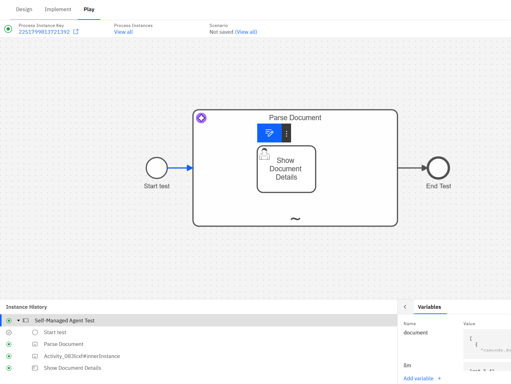
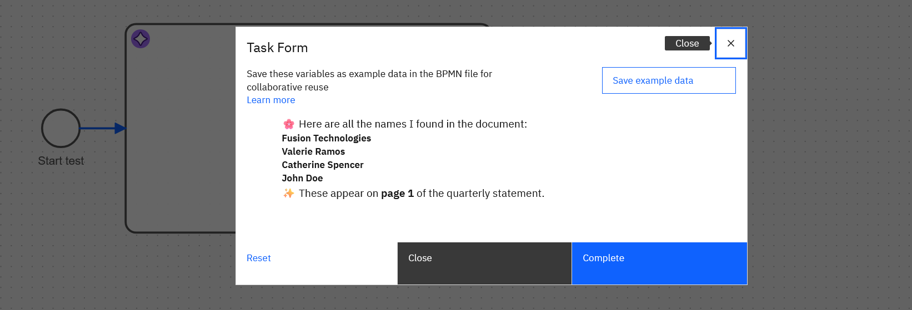

# Camunda 8 Self-Managed Agent Test

A test project to verify your Camunda 8 environment is properly configured to run agentic AI processes using the AI Agent Connector.



## Overview

This project provides agentic process implementations that demonstrate document parsing capabilities using AI. It's designed to help you verify that you have all the necessary components, connectors, and configurations in place to run AI-powered workflows in your Camunda 8 environment.

There are two process variants, each in its own folder:

| Folder | Provider | Auth |
|---|---|---|
| `OpenAITestProcess/` | OpenAI | OpenAI API Key |
| `BedrockAITestProcess/` | AWS Bedrock | AWS Access Key + Secret Key |

Both variants use an identical process flow and forms — the only difference is the AI provider and the secrets required.

## What This Process Does

The **Self-Managed Agent Test** process:

1. **Starts with a user form** where you can:
   - Enter custom instructions for the AI agent (e.g., "Find all the names in the document")
   - Upload a document (PDF, text, or other supported formats)
   - Select which LLM model to use

2. **Processes the document** using an AI agent that:
   - Parses the uploaded document
   - Follows your specific instructions
   - Calls tools as needed to fulfil your request
   - Maintains conversation context with in-process memory

3. **Displays the results** in a user task with markdown-formatted output

## Features

- **Agentic AI Processing**: Uses the Camunda AI Agent Connector to create an autonomous agent that can reason about tasks and use tools
- **Document Analysis**: Upload and analyse various document types
- **Flexible Instructions**: Custom prompts allow you to ask the agent to perform different tasks on your documents
- **Memory Management**: Agent maintains context across tool calls with a configurable 20-message context window
- **Tool Extensibility**: Built on an ad-hoc subprocess pattern that can easily be extended with additional tools
- **Dual Provider Support**: Choose between OpenAI or AWS Bedrock depending on your infrastructure

## Sample Test Document

A sample PDF is included in the `testDocs/` folder:

- `Fusion_Technologies_Quarterly_Statement_Branded_v2.pdf` — a quarterly statement you can use to test document parsing

---

## Installing the OpenAI Process

### Prerequisites

| Requirement | SaaS | Self-Managed |
|---|---|---|
| Camunda 8 (v8.8.0+) | ✅ Managed for you | ✅ Must be installed and running |
| AI Agent Connector | ✅ Available in marketplace | ✅ JAR must be deployed to Connector Runtime |
| Connector Runtime | ✅ Managed for you | ✅ Must be configured and running |
| OpenAI API Key | ✅ Required | ✅ Required |

### Step 1 — Install the AI Agent Connector Template `(SaaS and Self-Managed)`

This makes the connector available in your modeller so you can open and deploy the BPMN.

1. Visit the [Camunda Marketplace - AI Agent Connector](https://marketplace.camunda.com/en-US/apps/522488/ai-agent-connector)
2. Download the connector template JSON file
3. Install it in your modeller:
   - **Desktop Modeller**: Place the connector template in your `.camunda/element-templates` directory
   - **Web Modeller**: Upload via the Connector Template management interface in your organisation settings

> **Self-Managed only**: You must also deploy the AI Agent Connector JAR to your Connector Runtime. Without it, the runtime will not know how to execute the connector task.

### Step 2 — Configure the OpenAI Secret `(SaaS and Self-Managed)`

The process expects a secret named `OpenAI` containing your OpenAI API key.

**Camunda Console — SaaS and Self-Managed:**

1. Navigate to your Camunda Console
2. Go to **Organisation Settings** → **Secrets**
3. Click **Add Secret** and set:
   - **Name**: `OpenAI`
   - **Value**: Your OpenAI API key (starts with `sk-...`)
4. Save

**Environment variable — Self-Managed only:**

If you prefer to configure secrets at the runtime level rather than in Console:

```bash
CAMUNDA_CONNECTOR_OPENAI_APIKEY=sk-your-api-key-here
```

### Step 3 — Deploy the Process `(SaaS and Self-Managed)`

1. Open `OpenAITestProcess/Self-Managed Agent Test.bpmn` in Camunda Modeller or Web Modeller
2. Deploy the process to your Camunda 8 cluster
3. `Start test.form` and `Show Document Details.form` will be deployed automatically with the process

### Step 4 — Ensure the Connector Runtime is Running `(Self-Managed only)`

> SaaS users can skip this step — the Connector Runtime is managed for you.

Make sure your Connector Runtime is:
- Running and healthy
- Connected to your Camunda cluster
- Has outbound network access to `api.openai.com`
- Has the `OpenAI` secret configured (Step 2)

### Step 5 — Run the Test `(SaaS and Self-Managed)`

1. **Start a new process instance** from Tasklist or Operate
2. **Fill out the start form**:
   - **User Instructions**: What you want the agent to do (default: "Find all the names in the document")
   - **Upload The Document**: Select a file from `testDocs/` or your own document
   - **What LLM?**: The model to use (e.g. `gpt-4o` or `gpt-4.1`)
3. **Submit** to start the process
4. **View the results**: A user task will appear with the agent's response once processing completes

---

## Installing the Bedrock Process

### Prerequisites

| Requirement | SaaS | Self-Managed |
|---|---|---|
| Camunda 8 (v8.8.0+) | ✅ Managed for you | ✅ Must be installed and running |
| AI Agent Connector | ✅ Available in marketplace | ✅ JAR must be deployed to Connector Runtime |
| Connector Runtime | ✅ Managed for you | ✅ Must be configured and running |
| AWS account with Bedrock access | ✅ Required | ✅ Required |
| IAM credentials with `bedrock:InvokeModel` permission | ✅ Required | ✅ Required |

### Step 1 — Install the AI Agent Connector Template `(SaaS and Self-Managed)`

This makes the connector available in your modeller so you can open and deploy the BPMN.

1. Visit the [Camunda Marketplace - AI Agent Connector](https://marketplace.camunda.com/en-US/apps/522488/ai-agent-connector)
2. Download the connector template JSON file
3. Install it in your modeller:
   - **Desktop Modeller**: Place the connector template in your `.camunda/element-templates` directory
   - **Web Modeller**: Upload via the Connector Template management interface in your organisation settings

> **Self-Managed only**: You must also deploy the AI Agent Connector JAR to your Connector Runtime. Without it, the runtime will not know how to execute the connector task.

### Step 2 — Configure the AWS Secrets `(SaaS and Self-Managed)`

The process expects all four of the following secrets:

| Secret Name | Value |
|---|---|
| `AWS_REGION` | Your AWS region (e.g. `us-east-1`) |
| `AWS_ACCESS_KEY` | Your AWS Access Key ID |
| `AWS_SECRET_KEY` | Your AWS Secret Access Key |
| `AWS_LLM_STRING` | The Bedrock model ID (e.g. `anthropic.claude-3-5-sonnet-20241022-v2:0`) |

**Camunda Console — SaaS and Self-Managed:**

1. Navigate to your Camunda Console
2. Go to **Organisation Settings** → **Secrets**
3. Click **Add Secret** and create each of the four secrets above with the corresponding value
4. Save

**Environment variables — Self-Managed only:**

If you prefer to configure secrets at the runtime level rather than in Console:

```bash
CAMUNDA_CONNECTOR_AWS_REGION=us-east-1
CAMUNDA_CONNECTOR_AWS_ACCESSKEY=your-aws-access-key-id
CAMUNDA_CONNECTOR_AWS_SECRETKEY=your-aws-secret-access-key
CAMUNDA_CONNECTOR_AWS_LLMSTRING=anthropic.claude-3-5-sonnet-20241022-v2:0
```

> Ensure the model ID in `AWS_LLM_STRING` is enabled in your AWS account and available in the region you set in `AWS_REGION`.

### Step 3 — Deploy the Process `(SaaS and Self-Managed)`

1. Open `BedrockAITestProcess/Self-Managed Agent Test.bpmn` in Camunda Modeller or Web Modeller
2. Deploy the process to your Camunda 8 cluster
3. `Start test.form` and `Show Document Details.form` will be deployed automatically with the process

### Step 4 — Ensure the Connector Runtime is Running `(Self-Managed only)`

> SaaS users can skip this step — the Connector Runtime is managed for you.

Make sure your Connector Runtime is:
- Running and healthy
- Connected to your Camunda cluster
- Has outbound network access to the AWS Bedrock endpoint for your region
- Has all four AWS secrets configured (Step 2)

### Step 5 — Run the Test `(SaaS and Self-Managed)`

1. **Start a new process instance** from Tasklist or Operate
2. **Fill out the start form**:
   - **User Instructions**: What you want the agent to do (default: "Find all the names in the document")
   - **Upload The Document**: Select a file from `testDocs/` or your own document
   - **What LLM?**: This field is present on the form but the Bedrock process uses the model specified in the `AWS_LLM_STRING` secret
3. **Submit** to start the process
4. **View the results**: A user task will appear with the agent's response once processing completes

---

## Configuration Details



### Agent Configuration (both variants)

| Setting | Value |
|---|---|
| System Prompt | TaskAgent — helpful assistant for document-related requests |
| Memory | In-process storage, 20-message context window |
| Max model calls | 10 |
| Response format | Text, assistant message included |
| Tool behaviour | Waits for tool call results before proceeding |

### Provider-Specific Configuration

| Setting | OpenAI | Bedrock |
|---|---|---|
| Provider | `openai` | `bedrock` |
| Model selection | From form input (`=llm`) | From secret (`AWS_LLM_STRING`) |
| Auth secret(s) | `OpenAI` | `AWS_REGION`, `AWS_ACCESS_KEY`, `AWS_SECRET_KEY`, `AWS_LLM_STRING` |

---

## Troubleshooting

**Process won't deploy**
- Ensure the AI Agent Connector template is installed correctly
- Check that your Camunda version is 8.8.0 or higher

**Agent fails with authentication error (OpenAI)**
- Verify your `OpenAI` secret is configured and the name matches exactly
- Ensure the API key is valid and has available credits

**Agent fails with authentication error (Bedrock)**
- Verify all four AWS secrets are present and correctly named
- Confirm your IAM credentials have `bedrock:InvokeModel` permission
- Check that the model ID in `AWS_LLM_STRING` is enabled in the region set in `AWS_REGION`

**Connector not responding (Self-Managed)**
- Verify the Connector Runtime is running and the AI Agent Connector JAR is deployed
- Check connector runtime logs for errors
- Ensure outbound network connectivity to the provider's API endpoint

**Document upload fails**
- Check file size limits in your Camunda configuration
- Ensure the document format is supported by the chosen AI provider

---

## Next Steps

Once you've successfully run this test process, you can:

1. Build your own agentic workflows using either variant as a template
2. Add custom tools to the ad-hoc subprocess for domain-specific tasks
3. Integrate with your existing business processes
4. Explore advanced agent patterns like multi-step reasoning and tool chaining

## Resources

- [Camunda AI Agent Connector - Marketplace](https://marketplace.camunda.com/en-US/apps/522488/ai-agent-connector)
- [Camunda 8 Documentation](https://docs.camunda.io)
- [OpenAI API Documentation](https://platform.openai.com/docs)
- [AWS Bedrock Documentation](https://docs.aws.amazon.com/bedrock/)
- [Connector SDK Documentation](https://docs.camunda.io/docs/components/connectors/custom-built-connectors/connector-sdk/)

## License

This is a test project provided as-is for validation and learning purposes.
